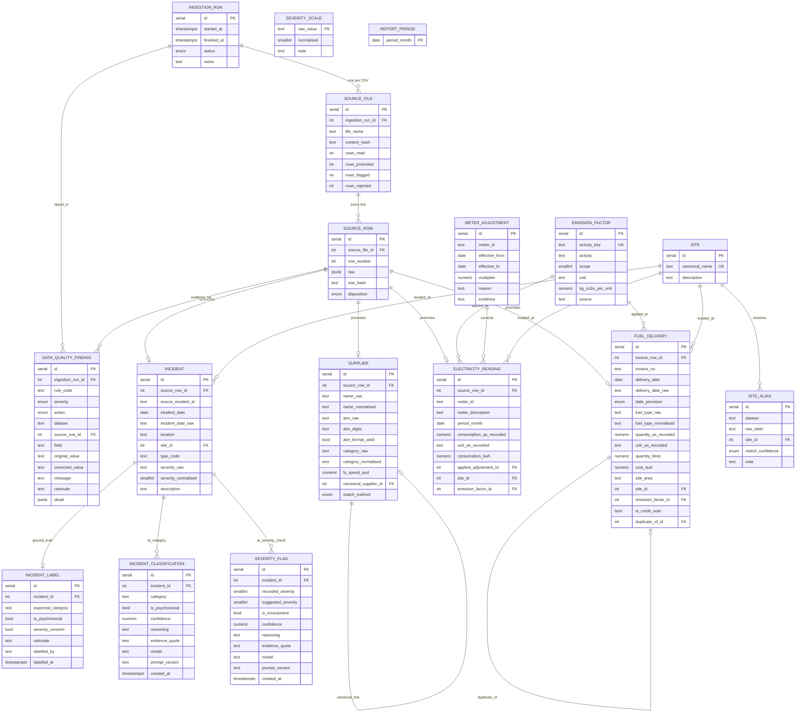

# Database schema

Seventeen tables, twenty foreign keys. Generated from `src/db/schema.ts`; the
diagram below draws every foreign key that exists and no relationship that does
not.

Two things it deliberately does *not* connect:

- **`supplier` and `fuel_delivery`.** `fuel_deliveries.csv` has no supplier
  column, so there is no row-level link between a delivery and who supplied it.
  Reconciliation against declared spend is aggregate-only.
- **`report_period` and `severity_scale`.** Both are joined by key rather than
  by foreign key, so they stand alone.

## Reading it

**Raw is immutable.** Every CSV line lands in `source_row` as jsonb and is never
edited. Cleaning promotes a corrected copy into a typed table beside it, and
records what changed in `data_quality_finding`. The `*_as_recorded` columns keep
the original value next to the canonical one, so "12.5 kL became 12,500 L" is a
column pair rather than a lost transformation.

**One CSV line promotes to exactly one domain row.** `source_row_id` is unique
in all four promoted tables, so a re-run ingest cannot double-count.

**Inferences are marked as inferences.** `match_method` says whether two
supplier records were proved identical by ABN or only matched on name.
`match_confidence` says whether a location label resolved exactly, was inferred,
or maps to nothing. `date_precision` says whether a date has a day.

**The AI layer interprets but never asserts.** `evidence_quote` must be an exact
substring of the incident description, or the classification is rejected.
`incident_label` holds hand-written ground truth, so the classifier can be
scored rather than trusted.

## Constraints worth knowing about

| Constraint | Why |
|---|---|
| `quantity_litres <> 0` | Not `> 0`. INV-41777 is a credit note; rejecting it would overstate Scope 1 by 12,500 litres of diesel. |
| `quantity_litres > 0 OR is_credit_note` | Negatives allowed only once identified. |
| `rows_read = rows_promoted + rows_rejected` | The pipeline cannot silently drop a row. |
| `rows_flagged <= rows_promoted` | Flagged is a subset, not a fourth outcome. |
| `severity_normalised BETWEEN 1 AND 5`, nullable | An unmappable severity stays null rather than being coerced. |
| `(match_confidence = 'unmapped') = (site_id IS NULL)` | An alias cannot claim a confidence it does not have. |
| `UNIQUE (source_row_id)` on all four promoted tables | One line, one row. |
| no `UNIQUE` on `source_incident_id` | `INC-2025-011` names two different incidents. The business key is not a key. |
